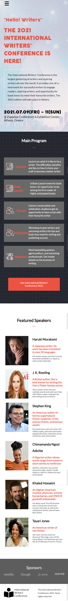
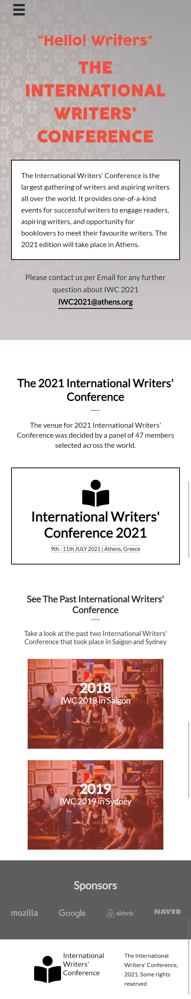

# Capstone Project - International-Writers-Conference-2021

This is a Microverse Capstone project for HTML, CSS and Javascript DOM. I set up my Capstone Project about an imaginary International Writers' Conference in Athens, Greece. The goal is to make 2 pages (home and about) for mobile and desktop version.

- 
- 
- 
- 

## :red_circle: Project Documentation Video

[Project Video](https://www.loom.com/share/4ff7bbe2fd524f6992b84434bb312ec3)
## :red_circle: Live Demo

[Live Preview Link](https://gunjuzone.github.io/International-Writers-Conference-2021/)

## :hammer: Built With

- HTML, CSS and JavaScript

To get a local copy up and running follow these simple steps:

1. Go to the [repository page](https://github.com/Gunjuzone/International-Writers-Conference-2021/tree/mobile-version).
2. git clone the repository using git command `git clone <link>`.
3. cd into the folder
4. git checkout branchName (mobile-version) using git command `git checkout <branchName>`.
5. Open home.html or about.html with live server

## :blue_book: Learning Objectives

- Use semantic HTML tags.
- Apply best practices in HTML code.
- Use CSS selectors correctly.
- Use CSS box model.
- Use Flexbox to place elements in the page.
- Demonstrate ability to create UIs adaptable to different screen sizes using media queries.
- Use GitHub Pages to deploy web pages.
- Apply JavaScript best practices and language style guides in code.
- Use JavaScript to manipulate DOM elements.
- Use JavaScript events.
- Use objects to store and access data.
- Communicate technical concepts to other technical people.

## Authors

👤 **Shakiru Olagunju**

- GitHub: [@Gunjuzone](https://github.com/Gunjuzone)

## 🤝 :raised_hand: :raised_hand: Contributions

Contributions, issues, and feature requests are welcome!

Feel free to check the [issues page](https://github.com/Gunjuzone/International-Writers-Conference-2021/issues).

## :grey_exclamation: Acknowledgments

- [Microverse](https://www.microverse.org/)
- [Cindy Shin](https://www.behance.net/adagio07)
- [Conference Design Guideline](https://www.behance.net/gallery/29845175/CC-Global-Summit-2015)

## 📝 License

This project is [MIT](LICENSE) licensed.
